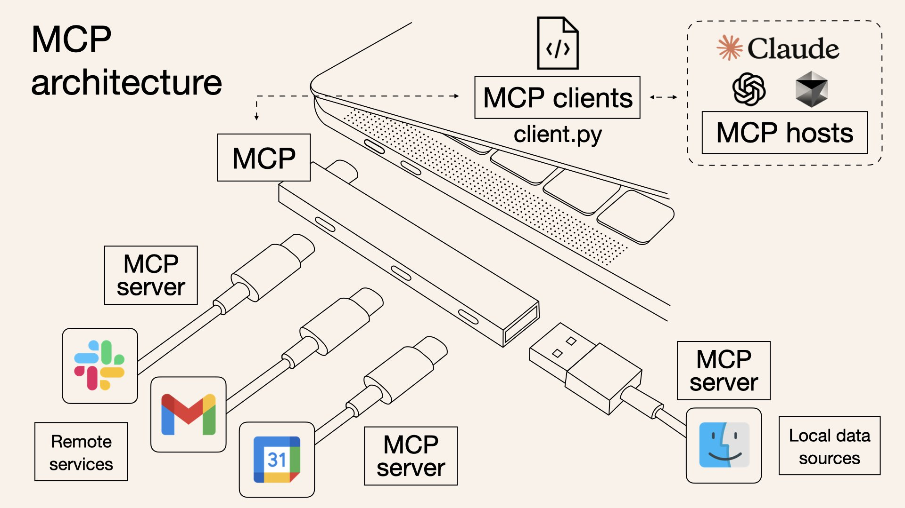

# 🤖 如何让你的 AI 代理集成 MCP 服务

[](README.md)
[](README-zh.md)


### 🤔 为什么 AI 代理需要与 MCP 集成？



模型上下文协议（Model Context Protocol，MCP）解决了 AI 语言模型的一个根本性限制：它们无法直接访问专业工具、实时数据或外部系统。通过将 AI 代理与 MCP 集成，开发者可以：

1. **克服 AI 局限性**：弥合 AI 通用知识与特定领域能力之间的差距
2. **创建可扩展系统**：无需重新训练基础 AI 模型即可添加新工具和功能
3. **构建模块化应用**：将 AI 推理与专业工具执行分离

### 🌟 MCP 集成的主要优势

1. **工具发现**：AI 代理可以动态发现多个服务器上的可用工具
2. **标准化接口**：为 AI 与工具之间的通信提供一致的协议
3. **分布式能力**：通过统一接口访问各种提供商的专业工具
4. **提高准确性**：利用专门构建的工具执行特定任务，而不仅仅依赖 AI 近似
5. **增强安全性**：工具在具有定义明确的输入/输出契约的隔离环境中执行
6. **实时数据访问**：将 AI 响应与外部系统的当前信息连接起来

这种集成模式将 AI 从受训练数据限制的封闭系统转变为开放、可扩展的平台，能够按需利用专业能力。


## 🔄 与 MCP 服务器集成的 2 个步骤

1. 🔌 MCP 客户端设置和服务器连接，工具发现

    **序列图**

    ```mermaid
    sequenceDiagram
        participant App as 应用程序
        participant Client as MCP 客户端
        participant Transport as StdioTransport
        participant Server as MCP 服务器
        
        App->>Client: initMCPServers()
        App->>Transport: new StdioClientTransport(config)
        Transport->>Server: 启动服务器进程
        Client->>Transport: client.connect(transport)
        Transport->>Server: 发送 hello
        Server->>Transport: Hello 响应
        Transport->>Client: 连接已建立
        Client->>Server: tools/list 请求
        Server->>Client: 可用工具列表
        Client->>App: 返回 McpServer 对象
        
        Note over App,Server: 服务器连接活跃
        
        App->>Client: disconnectAllServers()
        Client->>Transport: transport.close()
        Transport->>Server: 关闭连接
        Transport->>Client: onclose 事件
        Client->>App: 服务器已断开连接
    ```

    **代码示例**
    ```typescript
    import { Client } from "@modelcontextprotocol/sdk/client/index.js";
    import { StdioClientTransport } from "@modelcontextprotocol/sdk/client/stdio.js";
    import { ListToolsResultSchema } from "@modelcontextprotocol/sdk/types.js";

    async function connectToMcpServer(serverName, command, args = []) {
    // 创建 MCP 客户端
    const client = new Client(
        { name: "SimpleMCPClient", version: "1.0.0" },
        { capabilities: {} }
    );

    // 创建传输层
    const transport = new StdioClientTransport({
        command: command,
        args: args,
        env: process.env,
        stderr: "pipe",
    });

    // 连接到服务器
    await client.connect(transport);
    
    // 获取可用工具
    const toolsResponse = await client.request(
        { method: "tools/list" },
        ListToolsResultSchema
    );
    }

    ```

2. 🧠 AI 代理交互

    **序列图**

    ```mermaid
    sequenceDiagram
        participant User as 用户
        participant App as 主应用程序
        participant AIAgent as AI 代理
        participant LLM as 语言模型
        participant McpClient as MCP 客户端
        participant Server as MCP 服务器
        
        User->>App: 查询
        App->>AIAgent: processUserQuery(servers, aiModel, query)
        AIAgent->>LLM: generateText(systemPrompt, query)
        LLM->>AIAgent: 带有工具调用的初始响应
        
        Note over AIAgent: 使用正则表达式解析工具调用
        
        loop 对于每个工具调用
            AIAgent->>McpClient: callMcpTool(servers, serverName, toolName, args)
            McpClient->>Server: tools/call 请求
            Server->>McpClient: 工具执行结果
            McpClient->>AIAgent: 格式化并返回结果
        end
        
        AIAgent->>LLM: 使用工具结果生成文本
        LLM->>AIAgent: 最终响应
        AIAgent->>App: 返回最终响应
        App->>User: 显示响应
    ```

    **代码示例**
    ```typescript
    import { generateText } from "ai";

    // 工具调用的提示格式
    const systemPrompt = `您可以使用以下格式调用工具：
    <use_mcp_tool>
    <server_name>server_name</server_name>
    <tool_name>tool_name</tool_name>
    <arguments>
    {
    "param1": "value1",
    "param2": "value2"
    }
    </arguments>
    </use_mcp_tool>

    可用工具：
    ${servers.map(server => 
    `服务器: ${server.name}\n工具: ${server.tools.map(t => 
        `${t.name} - ${t.description || '无描述'}`
    ).join(', ')}`
    ).join('\n')}`;

    async function processWithAIAgent(model, servers, userQuery) {
    // 获取可能包含工具调用的初始 AI 响应
    const { text: aiResponse } = await generateText({
        model,
        system: systemPrompt,
        messages: [{ role: "user", content: userQuery }]
    });
    
    // 使用正则表达式提取工具调用
    const toolCallRegex = /<use_mcp_tool>[\s\S]*?<server_name>([\s\S]*?)<\/server_name>[\s\S]*?<tool_name>([\s\S]*?)<\/tool_name>[\s\S]*?<arguments>([\s\S]*?)<\/arguments>[\s\S]*?<\/use_mcp_tool>/g;
    const matches = [...aiResponse.matchAll(toolCallRegex)];
    
    // 执行工具调用
    const results = [];
    for (const match of matches) {
        const serverName = match[1].trim();
        const toolName = match[2].trim();
        const args = JSON.parse(match[3].trim());
        
        const server = servers.find(s => s.name === serverName);
        if (server) {
        try {
            // 调用 MCP 工具
            const result = await server.client.request({
            method: "tools/call",
            params: {
                name: toolName,
                arguments: args
            }
            });
            results.push({ serverName, toolName, result: result.content });
        } catch (error) {
            results.push({ serverName, toolName, error: error.message });
        }
        }
    }
    
    // 使用工具结果生成最终响应
    const finalResponse = await generateText({
        model,
        system: systemPrompt,
        messages: [
        { role: "user", content: userQuery },
        { role: "assistant", content: aiResponse },
        { role: "user", content: `工具结果: ${JSON.stringify(results)}` }
        ]
    });
    
    return finalResponse.text;
    }
    ```

    此代码展示了 AI 代理如何通过结构化工作流与 MCP 工具集成：
    1. 📝 系统提示告知 AI 关于可用 MCP 工具及其使用格式
    2. 💬 AI 生成可能包含结构化格式工具调用的响应
    3. 🔍 代码使用正则表达式解析这些工具调用，提取服务器名称、工具名称和参数
    4. 🛠️ 对于每个工具调用，它找到相应的服务器并执行请求的工具
    5. 📊 收集结果并将其发送回 AI 以生成最终响应

    这种方法弥合了通用 AI 语言能力与专业计算任务之间的差距，创建了更强大且更有用的 AI 应用程序。 

## 运行实例代码

点击 [run demo](doc/run-demo.md) 文件查看详细信息