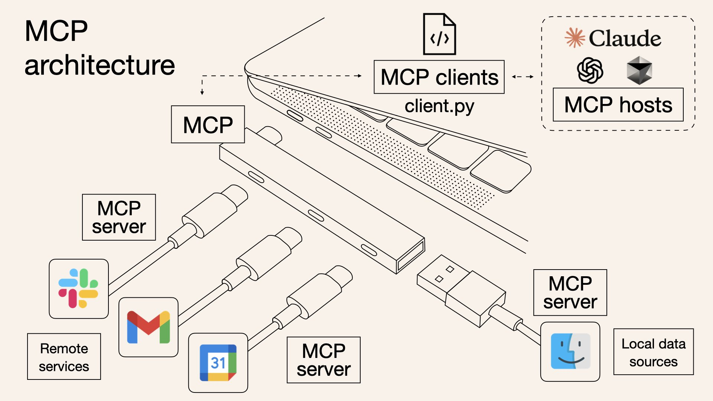

# 🤖 Introduction: Integrating AI Agents with MCP

[](README.md)
[](README-zh.md)


### 🤔 Why AI Agent Integrate with MCP?




The Model Context Protocol (MCP) addresses a fundamental limitation of AI language models: their inability to directly access specialized tools, real-time data, or external systems. By integrating AI agents with MCP, developers can:

1. **Overcome AI Limitations**: Bridge the gap between AI's general knowledge and specific domain capabilities
2. **Create Extensible Systems**: Add new tools and capabilities without retraining the underlying AI model
3. **Build Modular Applications**: Separate AI reasoning from specialized tool execution

### 🌟 Key Benefits of MCP Integration

1. **Tool Discovery**: AI agents can dynamically discover available tools across multiple servers
2. **Standardized Interface**: Consistent protocol for AI-to-tool communication
3. **Distributed Capabilities**: Access specialized tools from various providers through a unified interface
4. **Improved Accuracy**: Leverage purpose-built tools for specific tasks rather than relying solely on AI approximations
5. **Enhanced Security**: Tools execute in isolated environments with defined input/output contracts
6. **Real-time Data Access**: Connect AI responses with current information from external systems

This integration pattern transforms AI from a closed system limited by its training data into an open, extensible platform that can leverage specialized capabilities on demand.


## 🔄 2 Steps to Integration With MCP Server

1. 🔌 MCP client setup and server connections, tool discovery

    **Sequence Chart**

    ```mermaid
    sequenceDiagram
        participant App as Application
        participant Client as MCP Client
        participant Transport as StdioTransport
        participant Server as MCP Server
        
        App->>Client: initMCPServers()
        App->>Transport: new StdioClientTransport(config)
        Transport->>Server: Start server process
        Client->>Transport: client.connect(transport)
        Transport->>Server: Send hello
        Server->>Transport: Hello response
        Transport->>Client: Connection established
        Client->>Server: tools/list request
        Server->>Client: Available tools
        Client->>App: Return McpServer object
        
        Note over App,Server: Server connection active
        
        App->>Client: disconnectAllServers()
        Client->>Transport: transport.close()
        Transport->>Server: Close connection
        Transport->>Client: onclose event
        Client->>App: Server disconnected
    ```

    **Code Example**
    ```typescript
    import { Client } from "@modelcontextprotocol/sdk/client/index.js";
    import { StdioClientTransport } from "@modelcontextprotocol/sdk/client/stdio.js";
    import { ListToolsResultSchema } from "@modelcontextprotocol/sdk/types.js";

    async function connectToMcpServer(serverName, command, args = []) {
    // Create MCP client
    const client = new Client(
        { name: "SimpleMCPClient", version: "1.0.0" },
        { capabilities: {} }
    );

    // Create transport layer
    const transport = new StdioClientTransport({
        command: command,
        args: args,
        env: process.env,
        stderr: "pipe",
    });

    // Connect to server
    await client.connect(transport);
    
    // Get available tools
    const toolsResponse = await client.request(
        { method: "tools/list" },
        ListToolsResultSchema
    );
    }

    ```

2. 🧠 AI agent interaction

    **Sequence Chart**

    ```mermaid
    sequenceDiagram
        participant User
        participant App as Main App
        participant AIAgent as AI Agent
        participant LLM as Language Model
        participant McpClient as MCP Client
        participant Server as MCP Server
        
        User->>App: Query
        App->>AIAgent: processUserQuery(servers, aiModel, query)
        AIAgent->>LLM: generateText(systemPrompt, query)
        LLM->>AIAgent: Initial response with tool calls
        
        Note over AIAgent: Parse tool calls with regex
        
        loop For each tool call
            AIAgent->>McpClient: callMcpTool(servers, serverName, toolName, args)
            McpClient->>Server: tools/call request
            Server->>McpClient: Tool execution result
            McpClient->>AIAgent: Format and return result
        end
        
        AIAgent->>LLM: generateText with tool results
        LLM->>AIAgent: Final response
        AIAgent->>App: Return final response
        App->>User: Display response
    ```

    **Code Example**
    ```typescript
    import { generateText } from "ai";

    // Tool calling pattern in prompt format
    const systemPrompt = `You can use tools with this format:
    <use_mcp_tool>
    <server_name>server_name</server_name>
    <tool_name>tool_name</tool_name>
    <arguments>
    {
    "param1": "value1",
    "param2": "value2"
    }
    </arguments>
    </use_mcp_tool>

    Available tools:
    ${servers.map(server => 
    `Server: ${server.name}\nTools: ${server.tools.map(t => 
        `${t.name} - ${t.description || 'No description'}`
    ).join(', ')}`
    ).join('\n')}`;

    async function processWithAIAgent(model, servers, userQuery) {
    // Get initial AI response with potential tool calls
    const { text: aiResponse } = await generateText({
        model,
        system: systemPrompt,
        messages: [{ role: "user", content: userQuery }]
    });
    
    // Extract tool calls using regex
    const toolCallRegex = /<use_mcp_tool>[\s\S]*?<server_name>([\s\S]*?)<\/server_name>[\s\S]*?<tool_name>([\s\S]*?)<\/tool_name>[\s\S]*?<arguments>([\s\S]*?)<\/arguments>[\s\S]*?<\/use_mcp_tool>/g;
    const matches = [...aiResponse.matchAll(toolCallRegex)];
    
    // Execute tool calls
    const results = [];
    for (const match of matches) {
        const serverName = match[1].trim();
        const toolName = match[2].trim();
        const args = JSON.parse(match[3].trim());
        
        const server = servers.find(s => s.name === serverName);
        if (server) {
        try {
            // Call the MCP tool
            const result = await server.client.request({
            method: "tools/call",
            params: {
                name: toolName,
                arguments: args
            }
            });
            results.push({ serverName, toolName, result: result.content });
        } catch (error) {
            results.push({ serverName, toolName, error: error.message });
        }
        }
    }
    
    // Generate final response with tool results
    const finalResponse = await generateText({
        model,
        system: systemPrompt,
        messages: [
        { role: "user", content: userQuery },
        { role: "assistant", content: aiResponse },
        { role: "user", content: `Tool results: ${JSON.stringify(results)}` }
        ]
    });
    
    return finalResponse.text;
    }
    ```

    This code demonstrates how an AI agent integrates with MCP tools through a structured workflow:
    1. 📝 A system prompt informs the AI about available MCP tools and their usage format
    2. 💬 The AI generates a response that may include tool calls in a structured format
    3. 🔍 The code parses these tool calls using regex to extract server name, tool name, and arguments
    4. 🛠️ For each tool call, it finds the appropriate server and executes the requested tool
    5. 📊 The results are collected and sent back to the AI for a final response

    This approach bridges the gap between general AI language capabilities and specialized computing tasks, creating more powerful and useful AI applications.

## Run the demo code locally

Check [run demo](doc/run-demo.md) file for more information